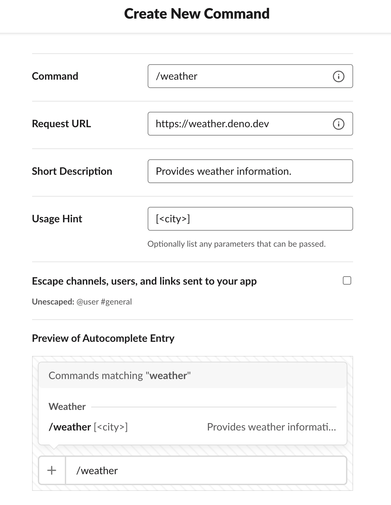

# Weather

A Slack Slash Command to access weather information.

## Installation

Go to https://api.slack.com/apps?new_app and create an app. After successful app creation, click on "Slash Commands" section and fill out the details as shown below.



After filling the details click on "Save" button that might at bottom right of the page. That's it!

## Usage

After the Slack App is setup with the Slash command, run the below command to get weather information of a place.

```
/weather [<city>]
```

Additionally, you can avoid passing the city argument to get weather information of a random city from the [list](cities.js).
